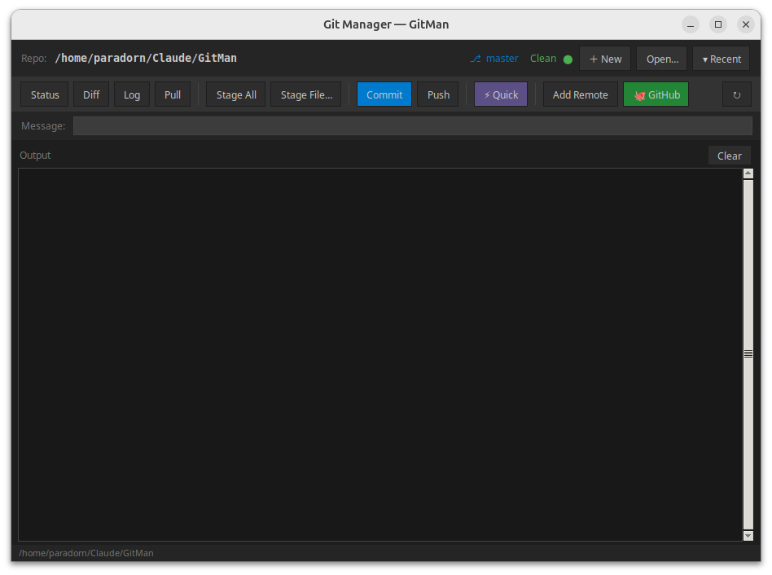

# GitMan

A full-featured desktop GUI for Git, built with Python and Tkinter.  
Dark-themed, thread-safe, works with any local repository.

   



---

## Version History

| Version | Changes |
|---------|---------|
| **v2.0.0** | Menu bar, branch manager, stash manager, tag manager, clone, fetch, staged diff, reset, revert, cherry-pick, amend, blame, reflog, force push, manage remotes, git config, and more |
| v1.0.0 | Initial release — status, diff, log, pull, stage, commit, push, quick, add remote, GitHub create |

---

## Requirements

- Python 3.8 or later
- Tkinter (included with most Python installations)
- Git installed and available in PATH
- GitHub CLI (`gh`) — optional, required for **🐙 GitHub** feature

---

## Run

```bash
python3 gitman.py
```

Or add an alias to `~/.bashrc`:

```bash
alias gitman='python3 /path/to/GitMan/gitman.py'
```

---

## Interface Overview

```
[Menu bar: File | View | Stage | Commit | Branch | Remote | Stash | Tags]
[Repo bar: path | ⎇ branch-switcher | ● status | New | Clone | Open | Recent]
[Toolbar:  Status | Diff | Staged | Log | Fetch | Pull | Stage All | Stage File | Unstage | Commit | Push | ⚡Quick | Stash | Pop | Branch… | ↻]
[Message box: commit message field | Amend ☐]
[Output panel — colour-coded command output]
[Status bar]
```

---

## Menu Bar Reference

### File
| Item | Action |
|------|--------|
| ＋ New Repository… | Create a new local git repository |
| ⬇ Clone Repository… | Clone a remote repository to a local folder |
| Open Repository… | Open an existing repository folder |
| Git Config… | Set global `user.name` and `user.email` |

### View
| Item | Action |
|------|--------|
| Status | `git status` |
| Diff (unstaged) | `git diff` — changes not yet staged |
| Diff (staged) | `git diff --cached` — changes ready to commit |
| Log — Oneline | Last 30 commits, compact graph |
| Log — Detailed | Last 10 commits with file stats |
| Log — Graph all branches | Last 50 commits across all branches |
| Reflog | `git reflog` — full local history including resets |
| Show Commit… | `git show` for any hash or ref |
| Blame File… | `git blame` — line-by-line author view |
| ↻ Refresh | Reload branch name and status indicator |
| Clear Output | Clear the output panel |

### Stage
| Item | Action |
|------|--------|
| Stage All | `git add -A` |
| Stage File… | Pick a single file to stage |
| Unstage All | `git restore --staged .` |
| Discard All Changes | `git restore .` — revert all unstaged edits |
| Discard File… | Revert changes in one file |

### Commit
| Item | Action |
|------|--------|
| Commit | Commit staged files using the message box |
| Amend Last Commit | Pre-fill message box with last commit; check Amend |
| Revert Commit… | `git revert --no-edit <hash>` |
| Cherry-pick… | `git cherry-pick <hash>` |
| Reset… | Dialog: soft / mixed / hard reset to any ref |
| Clean Untracked… | `git clean -fd` — remove untracked files and dirs |

### Branch
| Item | Action |
|------|--------|
| Branch Manager… | Full dialog — list, switch, create, rename, delete, merge, rebase, track remote |
| New Branch… | Create and switch to a new branch |
| Rename Branch… | `git branch -m` |
| Delete Branch… | `git branch -d` (safe delete) |
| Merge Branch… | Merge a branch into current |
| Rebase onto… | Rebase current branch onto another |

### Remote
| Item | Action |
|------|--------|
| Fetch | `git fetch` |
| Fetch All (--prune) | `git fetch --all --prune` |
| Pull | `git pull` |
| Push | `git push -u origin HEAD` |
| Push Tags | `git push --tags` |
| Force Push (--force-with-lease) | Safe force push |
| Manage Remotes… | Add, update, or remove remotes |
| 🐙 Create GitHub Repo… | Create GitHub repo via `gh` CLI and optionally push |

### Stash
| Item | Action |
|------|--------|
| Stash Changes | `git stash push` |
| Stash with Message… | `git stash push -m "message"` |
| Pop Stash | `git stash pop` |
| Apply Stash… | Apply without removing (enter ref) |
| Stash Manager… | List all stashes with pop / apply / show / drop |
| Drop Stash… | `git stash drop <ref>` |
| Clear All Stashes | `git stash clear` |

### Tags
| Item | Action |
|------|--------|
| Tag Manager… | List tags with show / create / annotated / delete / push |
| List Tags | `git tag -l --sort=-version:refname` |
| Create Tag… | Lightweight tag |
| Create Annotated Tag… | `git tag -a` with message |
| Delete Tag… | `git tag -d` |
| Push All Tags | `git push --tags` |
| Push Tag… | Push a single named tag |

---

## Toolbar Quick Reference

| Button | Action |
|--------|--------|
| **Status** | Show working tree status |
| **Diff** | Show unstaged changes |
| **Staged** | Show staged changes |
| **Log** | Last 30 commits (graph) |
| **Fetch** | Fetch from remote |
| **Pull** | Pull from remote |
| **Stage All** | Stage every changed file |
| **Stage File…** | Stage one file via picker |
| **Unstage** | Unstage all files |
| **Commit** | Commit with message box |
| **Push** | Push to origin |
| **⚡ Quick** | Stage all → commit → push |
| **Stash** | Stash current changes |
| **Pop** | Pop latest stash |
| **Branch…** | Open Branch Manager |
| **↻** | Refresh status |

---

## Branch Switcher

The **⎇ branch combobox** in the repo bar shows all local branches.  
Selecting a branch immediately runs `git switch <branch>`.

---

## Amend Workflow

1. Click **Commit → Amend Last Commit** from the menu  
   *(or tick the **Amend** checkbox manually)*
2. Edit the pre-filled message in the message box
3. Click **Commit** — runs `git commit --amend`

---

## Reset Dialog

**Commit → Reset…** opens a dialog with:
- A ref input field (e.g. `HEAD~1`, `abc1234`)
- Mode selection: **Soft** (keep staged) · **Mixed** (keep working tree) · **Hard** (discard all)
- Hard reset requires confirmation

---

## Common Workflows

### New project from scratch
1. **File → New Repository** — create local repo with optional README
2. **Remote → 🐙 Create GitHub Repo** — create on GitHub and push

### Clone an existing repo
1. **File → Clone Repository** — enter URL and destination folder
2. App automatically opens the cloned repo

### Quick commit & push (most common)
1. Type a commit message in the message box
2. Click **⚡ Quick** — stages everything, commits, and pushes

### Step-by-step commit
1. **Stage All** — or **Stage File…** for selective staging
2. **Staged** — verify what will be committed
3. Type message → **Commit** → **Push**

### Branch workflow
1. Use the **⎇ combobox** in the repo bar to switch branches instantly
2. Or open **Branch Manager** for full control: create, rename, delete, merge, rebase

### Stash and switch
1. **Stash** — save current work-in-progress
2. Switch branch via combobox
3. Do other work, then **Pop** or open **Stash Manager** to restore

---

## Repo Management

- **＋ New** — create a folder, `git init`, optional README
- **Open…** — browse to any folder; offers `git init` if not a repo
- **⬇ Clone** — clone any URL to a chosen destination
- **▾ Recent** — dropdown of last 10 opened repos (saved to `~/.gitman_recent.json`)
- On startup, opens the last used repo automatically

---

## Status Indicator

| Colour | Meaning |
|--------|---------|
| 🟢 Green — Clean | No uncommitted changes |
| 🟠 Orange — Modified | Uncommitted changes exist |

---

## Output Panel

Command output is colour-coded:

| Colour | Meaning |
|--------|---------|
| Blue | Command being run |
| Green | Success |
| Red | Error |
| Orange | Info / warning |
| Gray | Secondary / verbose output |

---

## Commit Message Format

Every commit automatically appends co-author trailers:

```
Co-Authored-By: K.Paradorn <paradonk@gmail.com>
Co-Authored-By: Claude Sonnet 4.6 <noreply@anthropic.com>
```

Messages are passed as a list argument (not a shell string), so quotes,  
apostrophes, and special characters work without escaping.

---

## Files

```
GitMan/
├── gitman.py        # Main application (v2.0.0)
├── GitMan.png       # Screenshot
└── README.md        # This file
```

Config file created automatically:

```
~/.gitman_recent.json    # Recent repository list (last 10)
```
